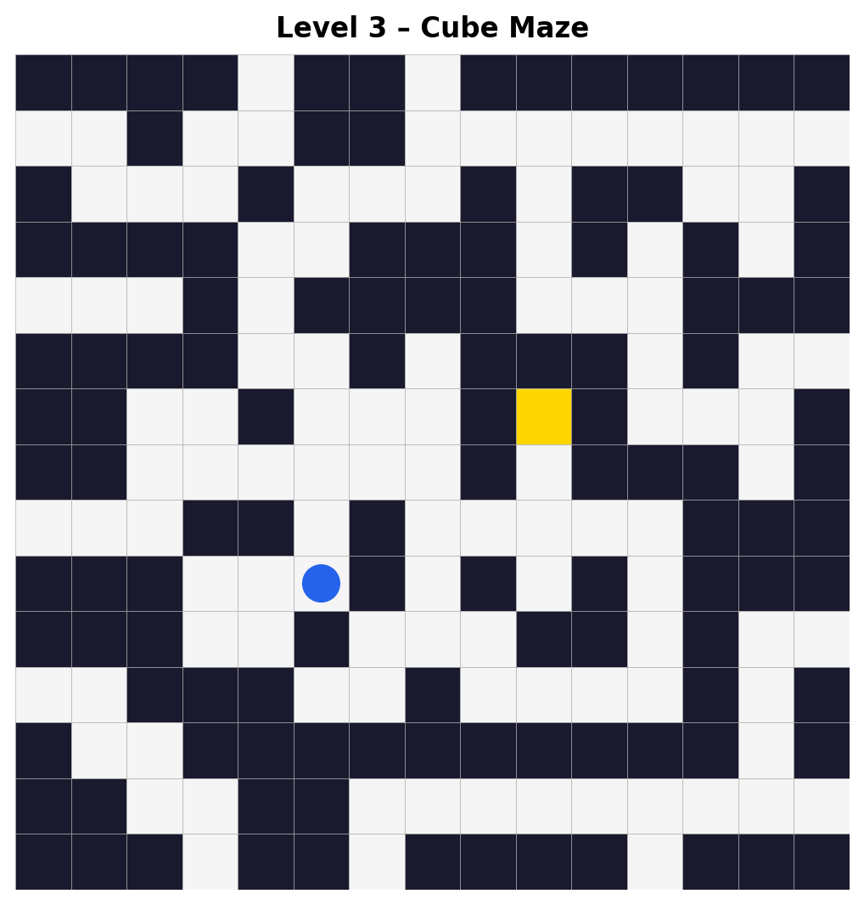
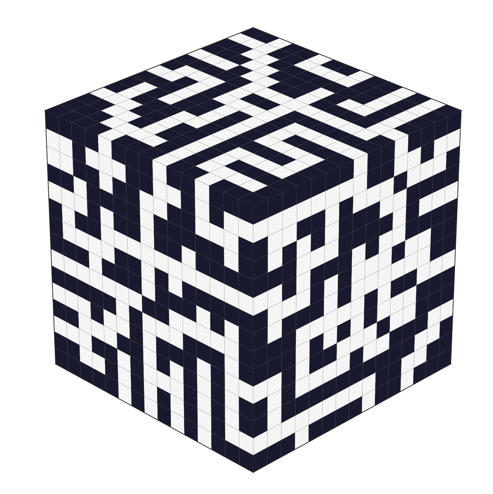

# Maze Game

A maze game built with Python and Tkinter for Code in Place 2026.

The game has three levels: a 1D maze, a 2D maze, and a 3D maze on the outside of a cube. Navigating off one edge of the grid moves the player to an adjacent face, rotating the view to match.

## Screenshots

 


## Controls

| Key | Action |
|-----|--------|
| `W` / `↑` | Move up |
| `S` / `↓` | Move down |
| `A` / `←` | Move left |
| `D` / `→` | Move right |


## Project structure

```
main.py       — entry point
game.py       — game logic and player movement
ui.py         — Tkinter UI and rendering
maze_data.py  — maze grids and cube transition table
solver.py     — BFS solver
```
